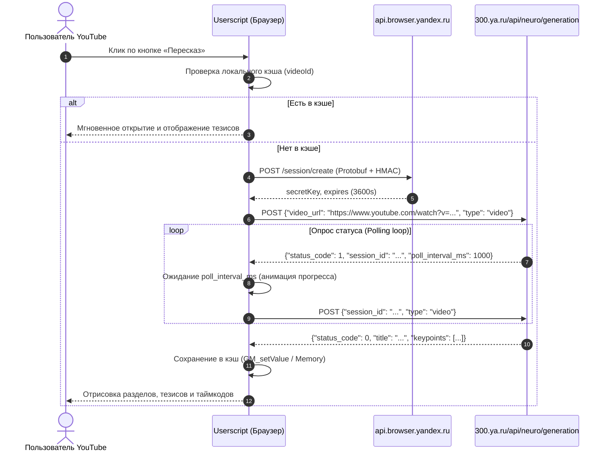

# 🎬 YouTube Video Summarizer (YandexGPT)

[](youtube-yandex-summarizer.user.js)
[](https://www.youtube.com/)
[](https://300.ya.ru/)
[-brightgreen)](package.json)
[](LICENSE)

Высокопроизводительный легковесный пользовательский скрипт (Userscript) для браузеров, добавляющий на YouTube нативную кнопку **«Пересказ»** и интерактивную выдвижную боковую панель с тезисами, ключевыми мыслями и кликабельными таймкодами на базе нейросетевых моделей **YandexGPT** (сервис `300.ya.ru`).

---

## 📑 Содержание

- [Обзор проекта](#-обзор-проекта)
- [Реверс-инжиниринг протокола Yandex](#-реверс-инжиниринг-протокола-yandex)
  - [1. Генерация защищенной сессии](#1-генерация-защищенной-сессии)
  - [2. Подписание запросов (HMAC-SHA256)](#2-подписание-запросов-hmac-sha256)
  - [3. Жизненный цикл суммаризации видео](#3-жизненный-цикл-суммаризации-видео)
- [Возможности и особенности](#-возможности-и-особенности)
- [Установка](#-установка)
  - [Tampermonkey (Chrome, Firefox, Edge, Opera, Brave)](#tampermonkey)
  - [Violentmonkey](#violentmonkey)
  - [Greasemonkey](#greasemonkey)
- [Сборка из исходников](#-сборка-из-исходников)
- [Тестирование и верификация](#-тестирование-и-верификация)
- [Структура проекта](#-структура-проекта)
- [Благодарности и дисклеймер](#-благодарности-и-дисклеймер)

---

## 🌟 Обзор проекта

В браузер **Яндекс Браузер** встроена уникальная функция краткого пересказа видеороликов с помощью нейросетей YandexGPT. Данный проект переносит эту функциональность в **любой современный браузер** (Google Chrome, Firefox, Microsoft Edge, Opera, Safari, Brave, Vivaldi) в виде чистого Userscript без сторонних серверов-посредников.

Запросы отправляются напрямую от клиента к официальным шлюзам Yandex через `GM_xmlhttpRequest`, обеспечивая максимальную скорость, безопасность и нулевую задержку.

---

## 🔬 Реверс-инжиниринг протокола Yandex

Взаимодействие с бэкендом Yandex построено на основе анализа протоколов Yandex Browser и открытых наработок проекта VOT (`voice-over-translation`).

### 1. Генерация защищенной сессии

Перед запросом суммаризации клиент получает криптографическую сессию от хоста авторизации:

- **Эндпоинт**: `POST https://api.browser.yandex.ru/session/create`
- **Протокол**: Protobuf Wire Format (без внешних зависимостей, реализован нативный кодировщик/декодировщик)
- **Схема запроса**:
  - Поле `1` (`0x0A`): `uuid` — случайная 32-значная шестнадцатеричная строка в верхнем регистре.
  - Поле `2` (`0x12`): `module` — строка `"neuroapi"`.
- **Подпись заголовка**: тело запроса подписывается по алгоритму **HMAC-SHA256** с фиксированным секретным ключом браузера:
  ```
  HMAC_SECRET = "bt8xH3VOlb4mqf0nqAibnDOoiPlXsisf"
  Header: Vtrans-Signature: <hex_digest>
  ```
- **Схема ответа**: Protobuf сообщение, содержащее `secretKey` (строка) и время жизни `expires` (3600 секунд).

### 2. Подписание запросов (HMAC-SHA256)

Каждый запрос к API нейросуммаризации снабжается одноразовым токеном безопасности:

```
Path: /api/neuro/generation
ComponentVersion: 26.8.3.1002
TokenPayload: ${uuid}:${path}:${ComponentVersion}
TokenSignature: HMAC_SHA256(TokenPayload, secretKey)
```

Заголовки запроса:
```http
X-Ya-Summary-Token: <TokenSignature>:<TokenPayload>
X-Ya-Summary-Sk: <secretKey>
X-Neuro-Page: yes
Content-Type: application/json
```

### 3. Жизненный цикл суммаризации видео



---

## ⚡ Возможности и особенности

- 🎯 **Нативная кнопка в плеере YouTube**:
  - Встраивается в блок действий (`#top-level-buttons-computed`, панель Like/Share/Download).
  - Полное соответствие дизайн-системе YouTube (шрифты, скругления, hover-эффекты, анимация загрузки).
  - Адаптация под **тёмную** и **светлую** темы YouTube через нативные CSS-переменные (`--yt-spec-*`).
  - Полная поддержка строгой политики **Trusted Types / TrustedHTML CSP** на YouTube.
- 📑 **Интерактивная боковая панель (Drawer)**:
  - Плавное выдвижение справа без перекрытия ключевых элементов управления плеером.
  - Поддержка **перетаскивания панели** по горизонтали за заголовок (drag-and-drop).
  - Кнопка быстрого закрытия и кнопка копирования пересказа.
- ⏱️ **Интерактивные таймкоды**:
  - Кликая по чипам таймкодов (`01:25`, `10:40`), плеер YouTube автоматически перематывает видео на нужный фрагмент и продолжает воспроизведение (`video.currentTime = seconds; video.play()`).
- 📋 **Копирование полного пересказа в один клик**:
  - Форматирует разделы, таймкоды и маркированные списки в читаемый текстовый формат с временным индикатором успешного копирования.
- 💾 **Двухуровневое кэширование**:
  - Быстрый кэш в оперативной памяти + кросс-вкладочный долгосрочный кэш через Tampermonkey `GM_getValue`/`GM_setValue` (TTL 24 часа). Повторное открытие видео мгновенно отображает ранее сгенерированный пересказ без повторных запросов к API.
- 🧭 **Поддержка YouTube Single Page Application (SPA)**:
  - Интеграция с событиями YouTube `yt-navigate-finish`, `spfdone`, `popstate` и `MutationObserver`. При переходе между роликами состояние панели и кнопок корректно сбрасывается и переинициализируется.
- 🛠️ **Команды меню расширения**:
  - В меню расширения Tampermonkey доступны быстрые команды: *«✨ Пересказать видео (YandexGPT)»* и *«🗑️ Очистить кэш пересказов»*.

---

## 🚀 Установка

### Tampermonkey

1. Установите расширение [Tampermonkey](https://www.tampermonkey.net/) для вашего браузера (Chrome Web Store, Firefox Add-ons, Microsoft Edge Add-ons).
2. Нажмите на иконку Tampermonkey в панели расширений и выберите **«Создать новый скрипт»** (Dashboard -> Создать).
3. Скопируйте всё содержимое файла [`youtube-yandex-summarizer.user.js`](youtube-yandex-summarizer.user.js) и вставьте в редактор.
4. Нажмите **Файл -> Сохранить** (Ctrl+S / Cmd+S).
5. Откройте любое видео на [YouTube](https://www.youtube.com/) — под видео появится кнопка **«Пересказ»**!

### Violentmonkey

1. Установите расширение [Violentmonkey](https://violentmonkey.github.io/).
2. Перейдите в панель управления Violentmonkey, нажмите кнопку **`+`** (Новый скрипт).
3. Вставьте содержимое [`youtube-yandex-summarizer.user.js`](youtube-yandex-summarizer.user.js) и нажмите кнопку сохранения.

### Greasemonkey

1. Установите дополнение [Greasemonkey](https://www.greasespot.net/) в Firefox.
2. Создайте новый пользовательский скрипт, скопируйте код и сохраните.

---

## 🔨 Сборка из исходников

Проект построен по модульному принципу в каталоге `src/summarizer/`:
- `core/crypto.js` — Web Crypto HMAC-SHA256 и UUID генератор.
- `core/session.js` — Protobuf wire format энкодер/декодер и менеджер сессий Yandex.
- `api/cache.js` — In-memory и Persistent Storage кэш с TTL.
- `api/client.js` — Парсер URL, форматтер таймкодов и клиент опроса `300.ya.ru`.
- `ui/styles.js` — CSS стили с поддержкой YouTube dark/light тем.
- `ui/dom-utils.js` — Безопасный DOM и Trusted Types (CSP) для YouTube.
- `ui/button.js` — Кнопка действия в плеере.
- `ui/panel.js` — Выдвижная боковая панель с главами, тезисами и drag-and-drop.
- `ui/observer.js` — Контроллер SPA-навигации YouTube.

Сборщик компилирует модули в монолитный самодостаточный Userscript:

```bash
# Сборка через npm
npm run build

# Или напрямую через Node.js:
node scripts/build-summarizer.js
```

Результаты сборки автоматически записываются в:
- `youtube-yandex-summarizer.user.js` (в корне рабочей директории)
- `dist/youtube-yandex-summarizer.user.js`

---

## 🧪 Тестирование и верификация

Проект покрыт полным набором изолированных и интеграционных тестов:

```bash
# Запуск всех тестов разом
npm test

# Либо запуск отдельных тестовых наборов:
node tests/test-summarizer-session.js   # Тестирование криптографии, Protobuf и создания сессий
node tests/test-summarizer-api.js       # Тестирование парсинга YouTube URL, кэша и API polling
node tests/test-summarizer-ui.js        # Тестирование компонентов UI, панели, кнопки и контроллера
node tests/test-summarizer-bundle.js    # Тестирование целостности бандла, синтаксиса vm.Script и GM-адаптеров
```

---

## 📁 Структура проекта

```
├── youtube-yandex-summarizer.user.js    # Собранный production userscript (корневой)
├── dist/
│   └── youtube-yandex-summarizer.user.js# Релизная сборка userscript
├── src/
│   └── summarizer/
│       ├── core/
│       │   ├── crypto.js               # HMAC-SHA256, Web Crypto, UUID
│       │   └── session.js              # Protobuf кодер/декодер, SessionManager
│       ├── api/
│       │   ├── cache.js                # SummaryCache (Memory + GM_storage + TTL)
│       │   └── client.js               # YandexVideoSummarizer API клиент
│       └── ui/
│           ├── styles.js               # CSS стили с адаптацией к темам YouTube
│           ├── dom-utils.js            # Безопасный DOM и Trusted Types (CSP)
│           ├── button.js               # Фабрика и инжектор кнопки действия
│           ├── panel.js                # Выдвижной Sidebar Drawer с тезисами
│           └── observer.js             # Контроллер SPA навигации и плеера
├── scripts/
│   └── build-summarizer.js             # Скрипт сборки Userscript бандла
├── tests/
│   ├── test-summarizer-session.js      # Тесты криптографии и сессий
│   ├── test-summarizer-api.js          # Тесты API и кэша
│   ├── test-summarizer-ui.js           # Тесты интерфейса и контроллера
│   └── test-summarizer-bundle.js       # Тесты итогового бандла
├── package.json                        # Метаданные пакета и npm-скрипты
├── LICENSE                             # Лицензия MIT
└── README.md                           # Документация проекта
```

---

## 🤝 Благодарности и дисклеймер

- Сервису [300.ya.ru](https://300.ya.ru/) и компании Яндекс за разработку нейросетевых технологий суммаризации текста и видео.
- Авторам проектов [voice-over-translation](https://github.com/ilyhalight/voice-over-translation) и `@vot.js` за исследование внутренней структуры протокола сессий Yandex Browser.
- Скрипт предназначен для персонального удобства и исследовательских целей при просмотре открытых видеоматериалов на платформе YouTube.
